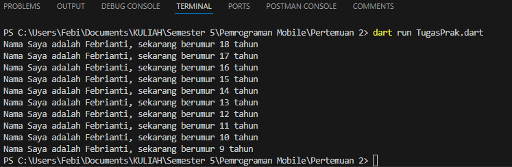

# Nama : Febrianti Mayori
# NIM : 2241720248
# Kelas : TI-3D

## Tugas Praktikum!
### SOAL 1
Modifikasilah kode pada baris 3 di VS Code atau Editor Code favorit Anda berikut ini agar mendapatkan keluaran (output) sesuai yang diminta!

```dart
void main() {
    for (int = 0; i < 10; i++) {
        print('hello $(i + 2)');
    }
}
```

Output yang diminta:
>

> Jawaban:
```dart
void main() {
    for (int i = 18; i > 8; i--) {
        print('Nama Saya adalah Febrianti, sekarang berumur $i tahun');
    }
}
```
> Hasil

> 

### SOAL 2
Mengapa sangat penting untuk memahami bahasa pemrograman Dart sebelum kita menggunakan framework Flutter ? Jelaskan!
> Jawaban: Karena bahasa pemrograman Dart sangat krusial karena Dart merupakan fondasi utama atau inti dari pengembangan Flutter, dengan memahami dasar bahasa tersebut akan lebih efektif dan efisien dalam mengerjakan pengembangan Flutter.

### SOAL 3
Rangkumlah materi dari codelab ini menjadi poin-poin penting yang dapat Anda gunakan untuk membantu proses pengembangan aplikasi mobile menggunakan framework Flutter.
> Jawaban: 
> 1. Dart sebagai Bahasa Utama Flutter: Dart adalah bahasa pemrograman utama yang digunakan untuk mengembangkan aplikasi dengan Flutter. Dart memiliki banyak keunggulan, seperti alat-alat pengembang yang efisien, pengelolaan memori otomatis, dan keamanan data yang baik melalui sistem tipe yang aman. Bahasa ini juga sangat fleksibel dan dapat digunakan untuk mengembangkan aplikasi di berbagai platform, termasuk web dan mobile.
> 2. Kompilasi dan Eksekusi Kode Dart: Kode Dart dapat dieksekusi menggunakan dua metode kompilasi: Just-In-Time (JIT) untuk pengembangan yang cepat dengan fitur seperti debugging dan hot reload, serta Ahead-Of-Time (AOT) untuk performa tinggi pada aplikasi yang sudah jadi. Hot reload adalah fitur penting yang memungkinkan pengembang melihat hasil perubahan kode dengan cepat tanpa perlu memuat ulang aplikasi sepenuhnya.
> 3. Fitur-Fitur Utama Dart: Dart mendukung pemrograman berorientasi objek (OOP) dengan fitur seperti inheritance dan polymorphism, serta menyediakan berbagai operator untuk perhitungan dan logika. Dart dirancang untuk efisiensi, performa tinggi, dan kemudahan dalam pengembangan aplikasi berskala besar. Memahami dasar-dasar Dart sangat penting untuk pengembang yang ingin menggunakan Flutter secara efektif dan produktif.

### SOAL 4
Buatlah slide yang berisi penjelasan dan contoh eksekusi kode tentang perbedaan Null Safety dan Late variabel ! (Khusus soal ini kelompok berupa link google slide)
> Jawaban: https://docs.google.com/presentation/d/1bg3qqC1g8XSPNLWvx1_JubSeDP9FfPKOj5qDIPKGAMo/edit?usp=sharing