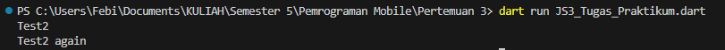
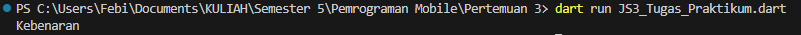
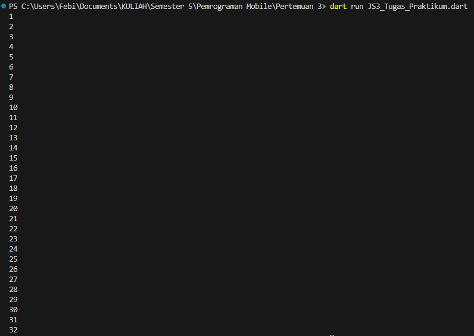
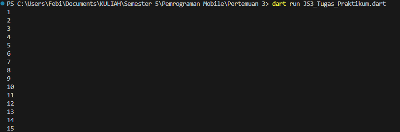
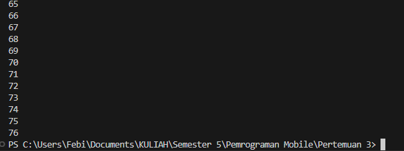
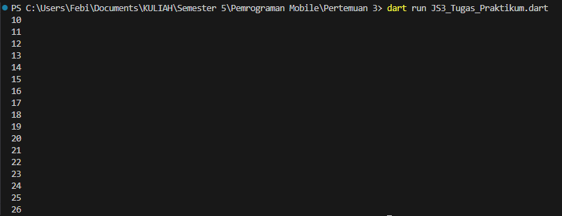
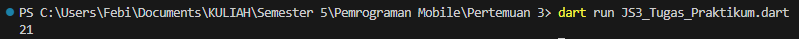
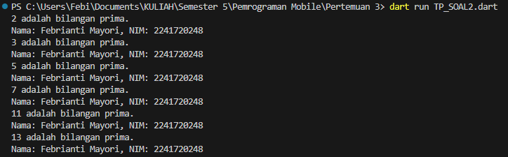

# #03 | Pengantar Bahasa Pemrograman Dart - Bagian 2 

## Nama : Febrianti Mayori
## NIM : 2241720248
## Kelas : TI-3D

### Tugas Praktikum!
#### SOAL 1
1. Silakan selesaikan Praktikum 1 sampai 3, lalu dokumentasikan berupa screenshot hasil pekerjaan beserta penjelasannya!
**Jawaban:**
#### Praktikum 1: Menerapkan Control Flows ("if/else")
**Langkah 1:**
Ketik atau salin kode program berikut ke dalam fungsi main().
```dart
String test = "test2";
if (test == "test1") {
   print("Test1");
} else if (test == "test2") {
   print("Test2");
} else {
   print("Something else");
}

if (test == "test2") print("Test2 again");
```

**Langkah 2:**
Silakan coba eksekusi (Run) kode pada langkah 1 tersebut. Apa yang terjadi? Jelaskan!
> * **Jawaban:** Yang terjadi adalah 2 pernyataan if diatas membandingkan 2 String menggunakan operator '=='. Sehingga menghasilkan output sebagai berikut, 
> 

**Langkah 3:**
Tambahkan kode program berikut, lalu coba eksekusi (Run) kode Anda.
```dart
String test = "true";
if (test) {
   print("Kebenaran");
}
```
Apa yang terjadi ? Jika terjadi error, silakan perbaiki namun tetap menggunakan if/else.
> * **Jawaban:** Terjadi eror, perbaikan kode:
```dart
String test = "true";
if (test == "true") {
    print("Kebenaran");
} else {
    print("Kesalahan");
}
```
> * 

> * Hasil output seperti gambar diatas, dikarenakan terdapat if atau jika test sama dengan true maka akan menghasilkan output "Kebenaran".

#### Praktikum 2: Menerapkan Perulangan "while" dan "do-while"
**Langkah 1:**
Ketik atau salin kode program berikut ke dalam fungsi main().
```dart
while (counter < 33) {
    print(counter);
    counter++;
}
```

**Langkah 2:**
Silakan coba eksekusi (Run) kode pada langkah 1 tersebut. Apa yang terjadi? Jelaskan! Lalu perbaiki jika terjadi error.
> * **Jawaban:** Terjadi eror dikarenakan variabel counter belum di inisialisasi. Perbaikan kode:
```dart
int counter = 1;
while (counter < 33) {
    print(counter);
    counter++;
}
```
> * Hasil: 

> * 

**Langkah 3:**
Tambahkan kode program berikut, lalu coba eksekusi (Run) kode Anda.
```dart
do {
    print(counter);
    counter++;
} while (counter < 77);
```
Apa yang terjadi ? Jika terjadi error, silakan perbaiki namun tetap menggunakan do-while.
> * **Jawaban:** Sama seperti langkah sebelumnya terjadi eror dikarenakan variabel counter belum di inisialisasi. Perbaikan kode:
```dart
int counter = 1;
do {
    print(counter);
    counter++;
} while (counter < 77);
```
> * Hasil:

> * 

> * 

#### Praktikum 3: Menerapkan Perulangan "for" dan "break-continue"
**Langkah 1:**
Ketik atau salin kode program berikut ke dalam fungsi main().
```dart
for (Index = 10; index < 27; index) {
  print(Index);
}
```

**Langkah 2:**
Silakan coba eksekusi (Run) kode pada langkah 1 tersebut. Apa yang terjadi? Jelaskan! Lalu perbaiki jika terjadi error.
> * **Jawaban:** Terjadi eror dikarenakan variabel index belum di inisialisasi dan terjadi ketidak konsisten-an terhadap penulisan code "index". Perbaikan kode:
```dart
int index;
for (index = 10; index < 27; index++) {
    print(index);
}
```
> * Hasil:

> * 

**Langkah 3:**
Tambahkan kode program berikut di dalam for-loop, lalu coba eksekusi (Run) kode Anda.
```dart
If (Index == 21) break;
Else If (index > 1 || index < 7) continue;
print(index);
```
Apa yang terjadi ? Jika terjadi error, silakan perbaiki namun tetap menggunakan for dan break-continue.
> * Hasil:
> * 

#### SOAL 2
2. Buatlah sebuah program yang dapat menampilkan bilangan prima dari angka 0 sampai 201 menggunakan Dart. Ketika bilangan prima ditemukan, maka tampilkan nama lengkap dan NIM Anda.
**Jawaban:**
> * Kode:
```dart
void main() {
    String nama = 'Febrianti Mayori';
    String nim = '2241720248';

    // Fungsi untuk mengecek bilangan prima menggunakan loop while
    bool isPrima(int bilangan) {
        if (bilangan < 2) return false; // Bilangan kurang dari 2 bukan bilangan prima
        int i = 2;
        while (i * i <= bilangan) { // Hanya perlu memeriksa hingga akar dari bilangan
            if (bilangan % i == 0) {
                return false; // Jika habis dibagi dengan bilangan lain, maka bukan bilangan prima
            }
            i++;
        }
    return true; // Jika tidak ada pembagi lain, maka bilangan prima
  }

    // Looping untuk mengecek bilangan prima dari 0 hingga 201
    int angka = 0;
    do {
        if(isPrima(angka)) {
            print('$angka adalah bilangan prima.');
            print('Nama: $nama, NIM: $nim');
        }
        angka++;
    } while (angka <= 201);
}
```
> * Hasil:

> * 


#### SOAL 3
3. Kumpulkan berupa link commit repo GitHub!