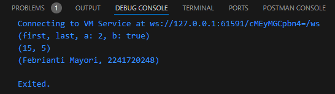

# #04 | Pengantar Bahasa Pemrograman Dart - Bagian 3 

## Nama : Febrianti Mayori
## NIM : 2241720248
## Kelas : TI-3D

### Tugas Praktikum!
#### SOAL 1
1. Silakan selesaikan Praktikum 1 sampai 5, lalu dokumentasikan berupa screenshot hasil pekerjaan Anda beserta penjelasannya!
**Jawaban:**
#### Praktikum 1: Eksperimen Tipe Data List
**Langkah 1:**
Ketik atau salin kode program berikut ke dalam void main().
```dart
void main() {
  var list = [1, 2, 3];
  assert(list.length == 3);
  assert(list[1] == 2);
  print(list.length);
  print(list[1]);

  list[1] = 1;
  assert(list[1] == 1);
  print(list[1]);
}
```

**Langkah 2:**
Silakan coba eksekusi (Run) kode pada langkah 1 tersebut. Apa yang terjadi? Jelaskan!
> * **Jawaban:** Yang terjadi adalah Assert tidak akan memunculkan error karena semua kondisi terpenuhi. Sehingga menghasilkan output sebagai berikut, 
> 

**Langkah 3:**
Ubah kode pada langkah 1 menjadi variabel final yang mempunyai index = 5 dengan default value = null. Isilah nama dan NIM Anda pada elemen index ke-1 dan ke-2. Lalu print dan capture hasilnya.
```dart
void main() {
  final List list = List.filled(6, null);
  list[1] = "Febrianti Mayori";
  list[2] = "2241720248";
  print(list.length);
  print(list[1]);
  print(list);
}
```
Apa yang terjadi ? Jika terjadi error, silakan perbaiki.
> * **Jawaban:** Tidak terjadi eror, kode ini menginisialisasi list dengan 6 elemen null, elemen pada indeks ke -1 dan ke-2 diubah. Sehingga output menampilkan panjang list, nilai elemen indeks ke-1, dan seluruh list.
> 

#### Praktikum 2: Eksperimen Tipe Data Set
**Langkah 1:**
Ketik atau salin kode program berikut ke dalam fungsi main().
```dart
void main() {
  var halogens = {'fluorine', 'chlorine', 'bromine', 'iodine', 'astatine'};
  print(halogens);
}
```

**Langkah 2:**
Silakan coba eksekusi (Run) kode pada langkah 1 tersebut. Apa yang terjadi? Jelaskan! Lalu perbaiki jika terjadi error.
> * **Jawaban:** Yang terjadi adalah ketika kode ini dijalankan, outputnya akan berupa set yang berisi elemen-elemen tersebut. Sehingga menghasilkan output sebagai berikut, 
> 

**Langkah 3:**
Tambahkan kode program berikut, lalu coba eksekusi (Run) kode Anda.
```dart
var names1 = <String>{};
Set<String> names2 = {}; // This works, too.
var names3 = {}; // Creates a map, not a set.

print(names1);
print(names2);
print(names3);
```
Apa yang terjadi ? Jika terjadi error, silakan perbaiki namun tetap menggunakan ketiga variabel tersebut. 
> * **Jawaban:** Tidak terjadi eror, Output hanya akan menampilkan `{}` tanpa nilai, karena set dan map yang dideklarasikan di sini adalah kosong.
> 

Tambahkan elemen nama dan NIM Anda pada kedua variabel Set tersebut dengan dua fungsi berbeda yaitu .add() dan .addAll(). Untuk variabel Map dihapus, nanti kita coba di praktikum selanjutnya.
```dart
void main() {
  var halogens = {'fluorine', 'chlorine', 'bromine', 'iodine', 'astatine'};
  print(halogens);
  var names1 = <String>{};
  Set<String> names2 = {}; // This works, too.

  names1.add("Febrianti Mayori");
  names2.addAll({"Febrianti Mayori", "2241720248"});

  print(names1);
  print(names2);
}
```
> Hasil:
> 

#### Praktikum 3: Eksperimen Tipe Data Maps
**Langkah 1:**
Ketik atau salin kode program berikut ke dalam fungsi main().
```dart
void main() {
  var gifts = {
    // Key:    Value
    'first': 'partridge',
    'second': 'turtledoves',
    'fifth': 1
  };

  var nobleGases = {
    2: 'helium',
    10: 'neon',
    18: 2,
  };

  print(gifts);
  print(nobleGases);
}
```

**Langkah 2:**
Silakan coba eksekusi (Run) kode pada langkah 1 tersebut. Apa yang terjadi? Jelaskan! Lalu perbaiki jika terjadi error.
> * **Jawaban:** Yang terjadi adalah kode ini mencetak 2 map, di mana hasil eksekusi akan menampilkan isi kedua map tanpa error. Sehingga menghasilkan output sebagai berikut, 
> 

**Langkah 3:**
Tambahkan kode program berikut, lalu coba eksekusi (Run) kode Anda.
```dart
var mhs1 = Map<String, String>();
gifts['first'] = 'partridge';
gifts['second'] = 'turtledoves';
gifts['fifth'] = 'golden rings';

var mhs2 = Map<int, String>();
nobleGases[2] = 'helium';
nobleGases[10] = 'neon';
nobleGases[18] = 'argon';
```
Apa yang terjadi ? Jika terjadi error, silakan perbaiki.
> * **Jawaban:** Tidak terjadi eror. 
> * Hasilnya adalah untuk map gifts, nilai key `fifth` diubah menjadi `golden rings`. Sedangkan untuk map nobleGases, nilai key 18 diubah menjadi `argon`.
> 

Tambahkan elemen nama dan NIM Anda pada tiap variabel di atas (gifts, nobleGases, mhs1, dan mhs2).
```dart
gifts.addAll({'Nama': 'Febrianti Mayori', 'NIM': '2241720248'});
nobleGases.addAll({4: 'Febrianti Mayori', 5: '2241720248'});
mhs1.addAll({'Nama': 'Febrianti Mayori', 'NIM': '2241720248'});
mhs2.addAll({1: 'Febrianti Mayori', 2: '2241720248'});
print("---------------------------------------------------------");
print("Menambahkan elemen nama dan NIM Anda pada tiap variabel.");
print("---------------------------------------------------------");
print(gifts);
print(nobleGases);
print(mhs1);
print(mhs2);
```
> Hasil:
> 

#### Praktikum 4: Eksperimen Tipe Data List: Spread dan Control-flow Operators
**Langkah 1:**
Ketik atau salin kode program berikut ke dalam fungsi main().
```dart
void main() {
  var list = [1, 2, 3];
  var list2 = [0, ...list];
  print(list1);
  print(list2);
  print(list2.length);
}
```

**Langkah 2:**
Silakan coba eksekusi (Run) kode pada langkah 1 tersebut. Apa yang terjadi? Jelaskan! Lalu perbaiki jika terjadi error.
> * **Jawaban:** Terjadi error dikarenakan variabel list1 tidak ada dalam kode. Yang ada adalah variabel list, jadi ini akan menyebabkan error undefined name 'list1'. Perbaikan kode,
```dart
void main() {
  var list = [1, 2, 3];
  var list2 = [0, ...list];
  print(list); // perbaikan
  print(list2);
  print(list2.length);
}
```
> * Setelah perbaikan kode maka akan menghasilkan output sebagai berikut, 
> 

**Langkah 3:**
Tambahkan kode program berikut, lalu coba eksekusi (Run) kode Anda.
```dart
list1 = [1, 2, null];
print(list1);
var list3 = [0, ...?list1];
print(list3.length);
```
Apa yang terjadi ? Jika terjadi error, silakan perbaiki.
> * **Jawaban:** Terjadi eror, karena variabel list1 tidak dideklarasikan sebelumnya, yang menyebabkan error "`undefined name list1`".
> 

Tambahkan variabel list berisi NIM Anda menggunakan Spread Operators!
```dart
var list1 = [1, 2, null];
print(list1);
var list3 = [2241720248, ...list1];
print(list3);
print(list3.length);
```
> Hasil:
> 

**Langkah 4:**
Tambahkan kode program berikut, lalu coba eksekusi (Run) kode Anda.
```dart
var nav = ['Home', 'Furniture', 'Plants', if (promoActive) 'Outlet'];
print(nav);
```
Apa yang terjadi ? Jika terjadi error, silakan perbaiki. Tunjukkan hasilnya jika variabel promoActive ketika true dan false.
> * **Jawaban:** Terjadi eror, karena variabel promoActive tidak dideklarasikan. Perbaikan kode,
```dart
// var promoActive = true;
var promoActive = false;
var nav = ['Home', 'Furniture', 'Plants', if (promoActive) 'Outlet'];
print(nav);
```
> * Ketika promoActive bernilai true, 'Outlet' akan muncul dalam set. 
> 
> * Namun, jika promoActive bernilai false, 'Outlet' tidak akan ditampilkan dalam set.
> 

**Langkah 5:**
Tambahkan kode program berikut, lalu coba eksekusi (Run) kode Anda.
```dart
var nav2 = ['Home', 'Furniture', 'Plants', if (login case 'Manager') 'Inventory'];
print(nav2);
```
Apa yang terjadi ? Jika terjadi error, silakan perbaiki. 
> * **Jawaban:** Terjadi eror, undefined name 'login'. Perbaikan kode,
```dart
var login = 'Manager';
  var nav2 = [
    'Home',
    'Furniture',
    'Plants',
    if (login case 'Manager') 'Inventory'
  ];
  print(nav2);
```
> * Hasil:
> 

Tunjukkan hasilnya jika variabel login mempunyai kondisi lain.
```dart
var login = 'Admin';
  var nav2 = [
    'Home',
    'Furniture',
    'Plants',
    if (login == 'Manager') 'Inventory'
  ];
  print(nav2);
```
> * **Jawaban:** Jika variabel `login` bernilai `'Manager'`, maka `'Inventory'` akan ditambahkan ke list; jika tidak, `'Inventory'` tidak akan ditambahkan. Sehingga hasil dari kode diatas sebagai berikut,
> 


**Langkah 6:**
Tambahkan kode program berikut, lalu coba eksekusi (Run) kode Anda.
```dart
var listOfInts = [1, 2, 3];
var listOfStrings = ['#0', for (var i in listOfInts) '#$i'];
assert(listOfStrings[1] == '#1');
print(listOfStrings);
```
Apa yang terjadi ? Jika terjadi error, silakan perbaiki. Jelaskan manfaat Collection For dan dokumentasikan hasilnya.
> * **Jawaban:** Tidak terjadi error. Fitur collection for digunakan untuk membuat elemen dalam list baru dengan memproses setiap elemen dari koleksi lain. Dan menghasilkan output berikut:
> 

#### Praktikum 5: Eksperimen Tipe Data Records
**Langkah 1:**
Ketik atau salin kode program berikut ke dalam fungsi main().
```dart
void main() {
  var record = ('first', a: 2, b: true, 'last');
  print(record)
}
```

**Langkah 2:**
Silakan coba eksekusi (Run) kode pada langkah 1 tersebut. Apa yang terjadi? Jelaskan! Lalu perbaiki jika terjadi error.
> * **Jawaban:** Terjadi error dikarenakan kurangnya tanda `;`. Perbaikan kode,
```dart
void main() {
  var record = ('first', a: 2, b: true, 'last');
  print(record);
}
```
> * Setelah perbaikan kode maka akan menghasilkan output sebagai berikut, 
> 

**Langkah 3:**
Tambahkan kode program berikut di luar scope void main(), lalu coba eksekusi (Run) kode Anda.
```dart
(int, int) tukar((int, int) record) {
  var (a, b) = record;
  return (b, a);
}
```
Apa yang terjadi ? Jika terjadi error, silakan perbaiki.
> * **Jawaban:** Hasil dari praktikum ini adalah tidak menghasilkan output apa pun, karena kode berada di luar fungsi `main` dan tidak dieksekusi.

Gunakan fungsi tukar() di dalam main() sehingga tampak jelas proses pertukaran value field di dalam Records.
```dart
void main() {
  var record = ('first', a: 2, b: true, 'last');
  print(record);

  // Langkah 3
  print(tukar((05, 15)));
}
```
> Hasil:
> 

**Langkah 4:**
Tambahkan kode program berikut di luar scope void main(), lalu coba eksekusi (Run) kode Anda.
```dart
// Record type annotation in a variable declaration:
(String, int) mahasiswa;
print(mahasiswa);
```
Apa yang terjadi ? Jika terjadi error, silakan perbaiki. Inisialisasi field nama dan NIM Anda pada variabel record mahasiswa di atas.
> * **Jawaban:** Terjadi eror, karena variabel mahasiswa tidak diinisiasi. Perbaikan kode,
```dart
(String, int) mahasiswa;
mahasiswa = ("Febrianti Mayori", 2241720248);
print(mahasiswa);
```
> Hasil:
> 

**Langkah 5:**
Tambahkan kode program berikut di luar scope void main(), lalu coba eksekusi (Run) kode Anda.
```dart
var nav2 = ['Home', 'Furniture', 'Plants', if (login case 'Manager') 'Inventory'];
print(nav2);
```
Apa yang terjadi ? Jika terjadi error, silakan perbaiki.
> * **Jawaban:** Hasilnya akan menampilkan isi dari record mahasiswa.
> 

Gantilah salah satu isi record dengan nama dan NIM Anda, lalu dokumentasikan hasilnya dan buat laporannya!
```dart
var mahasiswa2 = ('Febrianti Mayori', a: 2, b: true, '2241720248');
print(mahasiswa2.$1); // Prints 'first'
print(mahasiswa2.a); // Prints 2
print(mahasiswa2.b); // Prints true
print(mahasiswa2.$2); // Prints 'last'
```
> Hasil:
> 

#### SOAL 2
2. Jelaskan yang dimaksud Functions dalam bahasa Dart!
> **Jawaban:** Dalam bahasa dart, Functions adalah blok kode yang dapat dipanggil dan dieksekusi. Yang dapat menerima argumen (input) dan mengembalikan nilai (output). Functions di Dart dideklarasikan dengan kata kunci void untuk fungsi tanpa nilai kembali, atau tipe data lain untuk fungsi yang mengembalikan nilai.

#### SOAL 3
3. Jelaskan jenis-jenis parameter di Functions beserta contoh sintaksnya!
> **Jawaban:**
* Positional Parameters: Parameter yang harus diberikan dalam urutan yang sesuai. Contoh:
```dart
void greet(String name, int age) {
  print('Hello $name, you are $age years old.');
}

void main() {
  greet('Alice', 30); // Output: Hello Alice, you are 30 years old.
}
```
* Named Parameters: Parameter yang diberikan dengan nama. Dapat memiliki nilai default dan harus diberi nama saat memanggil fungsi. Contoh:
```dart
void greet({String name = 'Guest', int age = 0}) {
  print('Hello $name, you are $age years old.');
}

void main() {
  greet(name: 'Bob', age: 25); // Output: Hello Bob, you are 25 years old.
}
```
* Optional Parameters: Parameter yang tidak harus diberikan saat memanggil fungsi. Terdapat dua jenis:
> * Optional Positional Parameters: Didefinisikan dengan tanda kurung siku []. Contoh:
```dart
void greet(String name, [int age = 0]) {
  print('Hello $name, you are $age years old.');
}

void main() {
  greet('Charlie'); // Output: Hello Charlie, you are 0 years old.
}
```

> * Optional Named Parameters: Didefinisikan dengan tanda kurung kurawal {} dan dapat memiliki nilai default. Contoh:
```dart
void greet(String name, {int age = 0}) {
  print('Hello $name, you are $age years old.');
}

void main() {
  greet('Diana'); // Output: Hello Diana, you are 0 years old.
}
```

#### SOAL 4
4. Jelaskan maksud Functions sebagai first-class objects beserta contoh sintaknya!
> **Jawaban:** Dalam Dart, functions adalah objek kelas satu (first-class objects), yang berarti fungsi dapat diperlakukan sebagai nilai yang dapat disimpan dalam variabel, mengirimkannya sebagai argumen ke fungsi lain, dan dikembalikan sebagai nilai dari fungsi. Contoh:
```dart
Function createMultiplier(int factor) {
  return (int number) => number * factor;
}

void main() {
  var multiplyBy3 = createMultiplier(3);
  print(multiplyBy3(10)); // Output: 30
}
```

#### SOAL 5
5. Apa itu Anonymous Functions? Jelaskan dan berikan contohnya!
> **Jawaban:** Anonymous functions atau lambda functions adalah fungsi tanpa nama. Fungsi ini sering digunakan untuk operasi singkat yang tidak memerlukan nama fungsi eksplisit. Dalam Dart, anonymous functions sering digunakan dengan metode koleksi seperti forEach, map, atau where. Contoh:
```dart
void main() {
  var numbers = [1, 2, 3, 4];
  
  // Menggunakan anonymous function dengan forEach
  numbers.forEach((number) {
    print(number * 2); // Output: 2 4 6 8
  });
}
```

#### SOAL 6
6. Jelaskan perbedaan Lexical scope dan Lexical closures! Berikan contohnya!
> **Jawaban:** 
* Lexical scope merujuk pada cara akses variabel yang hanya bisa dilakukan dalam lingkungan (scope) di mana variabel tersebut didefinisikan. Contoh:
```dart
void main() {
  var outerVar = 'Hello';
  
  void innerFunction() {
    print(outerVar); // Output: Hello
  }
  
  innerFunction();
}
```
* Sedangkan Lexical closures adalah fungsi yang menyimpan referensi ke variabel dari lingkup luar ketika fungsi tersebut dibuat, memungkinkan fungsi untuk terus mengakses variabel tersebut bahkan setelah fungsi selesai dieksekusi. Contoh:
```dart
Function createCounter() {
  int count = 0;
  
  return () {
    count++;
    return count;
  };
}

void main() {
  var counter = createCounter();
  
  print(counter()); // Output: 1
  print(counter()); // Output: 2
}
```

#### SOAL 7
7. Jelaskan dengan contoh cara membuat return multiple value di Functions!
> **Jawaban:** Menggunakan Record. Yang memungkinkan untuk mengembalikan beberapa nilai secara langsung tanpa perlu mendefinisikan class terpisah. Record adalah tipe data ringan yang memungkinkan pengelompokan nilai dengan cara yang lebih sederhana. Contoh:
```dart
void main() {
  (int sum, int product) calculate(int a, int b) {
    return (a + b, a * b);
  }

  var result = calculate(5, 3);
  print('Sum: ${result.sum}, Product: ${result.product}'); // Output: Sum: 8, Product: 15
}
```

#### SOAL 8
8. Kumpulkan berupa link commit repo GitHub!