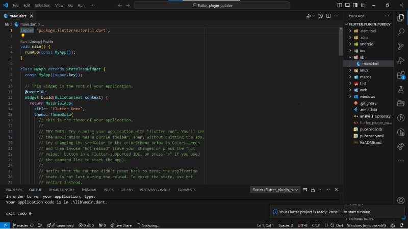
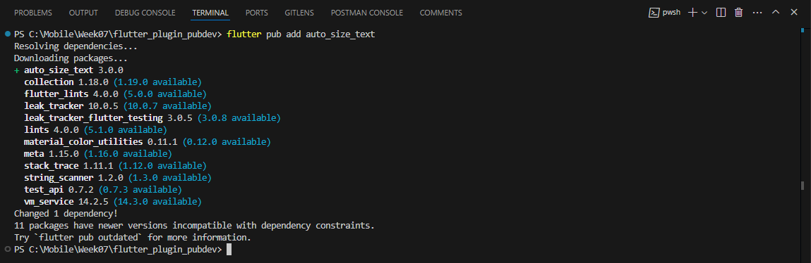
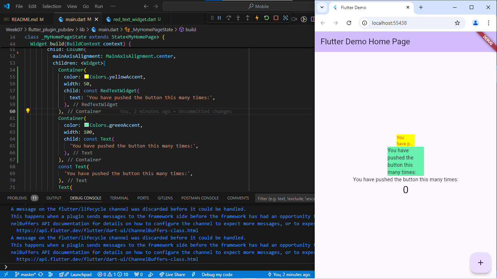
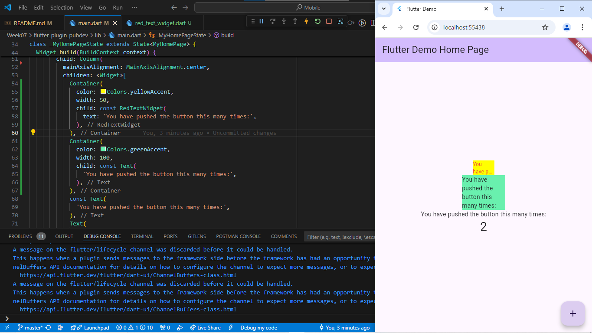
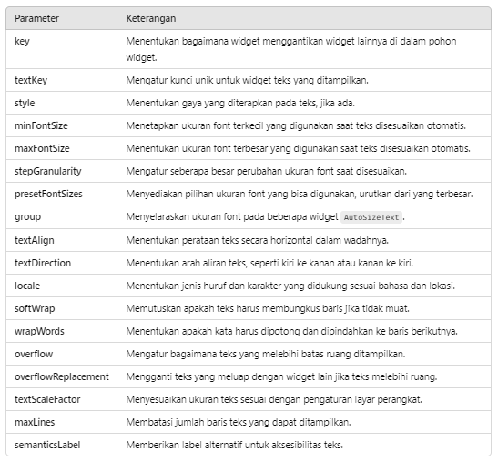

# **#07 | Manajemen Plugin**
## **Febrianti Mayori** | 2241720248 | TI-3D

## 1. Praktikum Individu: Menerapkan Plugin di Project Flutter
### Langkah 1: Buat Project Baru (flutter_plugin_pubdev)


### Langkah 2: Menambahkan Plugin
```dart
flutter pub add auto_size_text
```


### Langkah 3: Buat file red_text_widget.dart
```dart
import 'package:flutter/material.dart';

class RedTextWidget extends StatelessWidget {
  const RedTextWidget({Key? key}) : super(key: key);

  @override
  Widget build(BuildContext context) {
    return Container();
  }
}
```

### Langkah 4: Tambah Widget AutoSizeText
Mengubah file `red_text_widget.dart` dibagian kode return Container() menjadi seperti berikut:
```dart
return AutoSizeText(
    text,
    style: const TextStyle(color: Colors.red, fontSize: 14),
    maxLines: 2,
    overflow: TextOverflow.ellipsis,
);
```

### Langkah 5: Buat Variabel text dan parameter di constructor
Menambahkan variabel text dan parameter di constructor seperti berikut:
```dart
final String text;

const RedTextWidget({Key? key, required this.text}) : super(key: key);
```

### Langkah 6: Tambahkan widget di main.dart
Buka file `main.dart` lalu tambahkan di dalam `children:` pada class `_MyHomePageState`
```dart
Container(
    color: Colors.yellowAccent,
    width: 50,
    child: const RedTextWidget(
    text: 'You have pushed the button this many times:',
    ),
),
Container(
    color: Colors.greenAccent,
    width: 100,
    child: const Text(
    'You have pushed the button this many times:',
    ),
),
```

Hasil\



## 2. Jelaskan maksud dari langkah 2 pada praktikum tersebut!
**Jawab:** Menambahkan plugin `auto_size_text` ke dalam proyek Flutter melalui perintah terminal akan secara otomatis memperbarui file `pubspec.yaml` dengan menambahkan package `auto_size_text` dan menjalankan perintah `flutter pub get` untuk mengunduh package tersebut. Plugin ini berfungsi untuk menyesuaikan ukuran teks secara otomatis agar tetap terbaca dengan ukuran font yang optimal, meskipun ruang yang tersedia terbatas.

## 3. Jelaskan maksud dari langkah 5 pada praktikum tersebut!
**Jawab:** Langkah tersebut menjelaskan cara menambahkan variabel dan parameter pada constructor widget di Flutter. Variabel `text` berfungsi untuk menyimpan teks yang akan ditampilkan, sementara parameter di constructor digunakan untuk menginisialisasi variabel `text` tersebut.

## 4. Pada langkah 6 terdapat dua widget yang ditambahkan, jelaskan fungsi dan perbedaannya!
**Jawab:** Kedua widget tersebut berfungsi untuk menampilkan teks yang sama. Perbedaannya terletak pada widget `RedTextWidget`, yang membuat teks menyesuaikan dengan lebar widget. Sementara itu, pada widget `Text`, teks yang ditampilkan tidak menyesuaikan dengan lebar widget, sehingga jika lebar widget lebih kecil dari panjang teks, teks tersebut akan terpotong.

## 5. Jelaskan maksud dari tiap parameter yang ada di dalam plugin auto_size_text berdasarkan tautan pada dokumentasi ini !
> https://pub.dev/packages/auto_size_text

**Jawab:**
